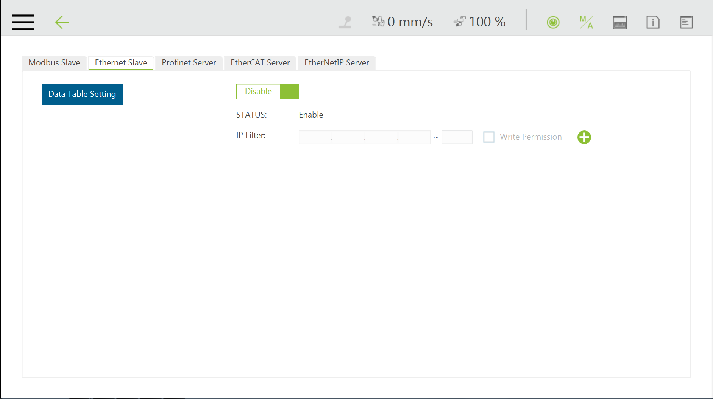
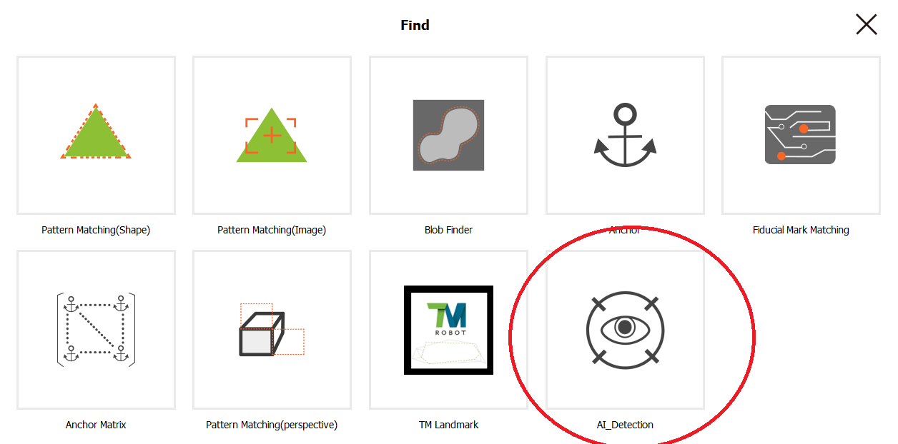
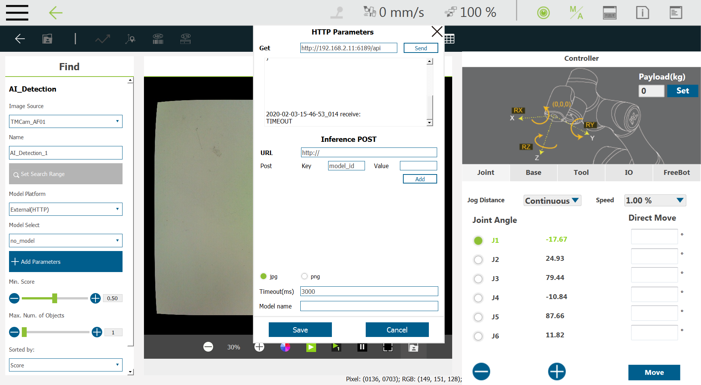
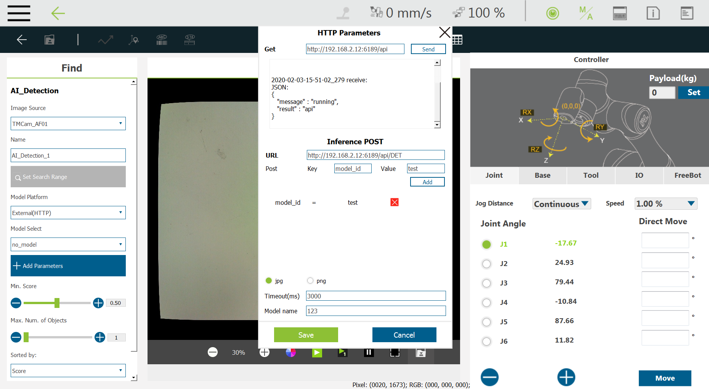

# __TM ROS Driver__

## __1. Overview__

The TM Robot is a state-of-the-art production tool that is highly compatible and flexible to collaboration between human and machine. The Robot Operating System (ROS) provides abundant libraries and tools which can be utilized to reduce the cost of trivial development software tool and build robot applications without struggling. Our TM ROS driver provides nodes for communication with Techman Robot controllers, data including robot states, images from the eye-in-hand camera and URDF models for various robot arms via _TMFlow_.

## __2. Feature__

This driver is for ROS2 Foxy version.

If you want to use Dashing version, please go to our [Dashing version driver](https://github.com/TechmanRobotInc/tmr_ros2/tree/dashing-devel).

If you want to know how to use this driver, please go to our [TM ROS1 driver](https://github.com/TechmanRobotInc/tmr_ros1)

### __ROS2 Driver__

The driver for ROS2 publishes identical topics and provides identical services as ROS1 version, but for now there is no interface integration with MoveIt.  
This driver uses _ros2 composition_, there are two nodes in the identical process:
one node publishes topics while the other node sets up service servers.

> __Usage__


>For example, execute the launch script to enable the driver to connect to tm5-900 robot  
>
>```bash
>ros2 launch tm_driver tm5_900_bringup.py >robot_ip:=YOUR_ROBOT_IP_ADDRESS
>```
>
> __Techman robot vision__
>
> - type: sensor_msgs::msg::Image
> - message name: techman_image

### __Installation__

> __Building from source__
>
> 1. install ROS and dependency :  
__for ROS2 :__  
install ROS2 (dashing)  
install ros-dashing-ros1-bridge
> 2. create workspace and clone package folder into _${WORKSPACE}/src_  
> 3. ```catkin_make```

## __3. Usage__

### __TMFlow setup__

> __Listen node__
>
> 1. Create a flow project; then choose the __listen__ node and the __Goto__ node
> 
>
> 2. Go to the __System/Network setting__ page  
Type network parameters of device for ROS
> 
>
> 3. Go to the __Setting/Connection__ page  
Enable the __Ethernet Slave__ item  
Click on the __Data Table Setting__ button and check the following boxes:
>
>       - [x] Robot_Error
>       - [x] Project_Run
>       - [x] Project_Pause
>       - [x] Safeguard_A
>       - [x] ESTOP
>       - [x] Camera_Light
>       - [x] Error_Code
>       - [x] Joint_Angle
>       - [x] Coord_Robot_Flange
>       - [x] Coord_Robot_Tool
>       - [x] TCP_Force
>       - [x] TCP_Force3D
>       - [x] TCP_Speed
>       - [x] TCP_Speed3D
>       - [x] Joint_Speed
>       - [x] Joint_Torque
>       - [x] Project_Speed
>       - [x] MA_Mode
>       - [x] Robot Light
>       - [x] Ctrl_DO0~DO7
>       - [x] Ctrl_DI0~DI7
>       - [x] Ctrl_AO0
>       - [x] Ctrl_AI0~AI1
>       - [x] END_DO0~DO3
>       - [x] END_DI0~DI2
>       - [x] END_AI0
>
>       
>
> __Vision__
>
> :warning: Before going through the following steps, please build the vision ROS node on other  (remote) computer and then connect this computer to the local techman robot computer.
>
> 1. Access the techman robot HMI and create a vision task.
> 2. Click the __AOI -only__ icon.
> 
>
>TMflow 1.76 second version only:<br/> 
>If no suitable dongle is detected, warning alerts will be displayed in the window.<br/>
> 
>TMflow 1.80 version: <br/>
>You don't need dongle to activate this function.
>
> 3. Click the __Find__ icon.
> 
>
> 4. In TMflow 1.76 second version, click the __AI_Detection__ icon.<br/>
> 
> In TMflow 1.80 version, click the __External Detection__ icon.
> 
>
> 5. In TMflow 1.76 second version, click the __+ Add Parameters__ button.
> 
> In TMflow 1.80 version, click the __Setting__ button.
>

> 6. To check whether the connection succeeds or not, please enter ``ROS_COMPUTER_IP:6189/api`` in the __HTTP Parameters__ blank text and click the __Send__ button to get the information of the remote computer for ROS.
> 
>
>       If the connection fails, __TIMEOUT__ error will be displayed in the window
> 
>
>       If the IP address of the (remote) ROS computer doesn't exist, **ERROR_CODE_7** will be displayed in the window.
> 
> 7. Enter ``ROS_COMPUTER_IP:6189/api/DET`` in the URL blank text and type arbitrary letters in the __Value__ blank text; the __Key__ will be generated automatically.
> 
> 8. Finally, assign a name to the model in  the __Model name__ blank text and click the __Save__ button.
> 

### __TM ROS driver usage__

> Change the current working directory of the terminal to your workspace`<workspace>`and set up the environment.
>
> ```bash
> cd <workspace>
> source devel/setup.bash
> ```
>
> Manipulate the virtual TM robot:
>
> ```bash
> roslaunch tm5_900_moveit_config tm5_900_moveit_planning_execution.launch sim:=True
> ```
>
> You can also manipulate TM robot in the real world:
>
> ```bash
> roslaunch tm5_900_moveit_config tm5_900_moveit_planning_execution.launch sim:=False robot_ip:=<robot_ip>
> ```
>
> The parameter `<robot_ip>` means the IP address of the robot control pc.

## __4. Vision__

### __Get image data through Techman Robot ROS2 driver__

> :warning: This package can only be built and run in ROS2 dashing. Other versions might not work.
>
> __Dependencies__
>
> - ROS2 dashing
> - Python packages:
>   1. flask
>   2. numpy
>   3. opencv-python==3.4.*
>   4. waitress
>   5. datetime
>
> __Installation__
>
> Create a dictionary and downlaod the repository.
>
>```bash
> mkdir ~/techman_ros2
> cd ~/techman_ros2
> colon build
> ```
>
> __The Techman Robot ROS2 node which publishes image data__
>
> ```bash
> cd ~/techman_ros2 && source install/setup.bash
> ros2 run tm_get_status image_talker
> ```
>
> The terminal prints ``Serving on <your_ip_address>:6189`` if the initialization succeeds.
>
> ```bash
> ros2 run custom_package sub_img
> ```
>
> The viewer will display image data from _TMFlow_.

## __3. Demo code__
There are some demo codes to show how to use this driver.

> 1. demo_send_script:<br/>
In this demo code, it shows how to send a listen node script to control the robot. <br/>
You can use service named "send_script" to send script.<br/>
"id"->The transaction number expressed in any alphanumeric characters . (Reports the CPERR 04 error if a non-alphanumeric byte is encountered .  When used as a communication packet response , it is a transaction number and identifies which group of commands to respond.<br/>
"script"-> the script which you want to send.<br/>
"ok" -> Correctness of the script.
> 2. demo_ask_item:<br/>
In this demo code, you can send TMSCT cmd by using this service. More details please refer to the Expression Editor and Listen Node.pdf(Chapter TMSCT<br/>
> 3. demo_ask_sta:<br/>
In this demo code, you can send TMSTA cmd by using this service. More details please refer to the Expression Editor and Listen Node.pdf(Chapter TMSTA<br/>
> 4. demo_connect_tm:<br/>
In this demo code, you can set connection. <br/>
If you set to reconnect as true, every time when driver disconnects from listen node, it will try to re-connect it.<br/>
There are two topics you can use, one is "connect_tmsvr" which is setting ethercad server connection, and the other is "connect_tmsct" which is setting TM-Flow connection.<br/>
> 5. demo_set_event:<br/>
In this demo code, there are six types of events you can use.<br/> 
func: You can use TAG, WAIT_TAG, STOP, PAUSE, RESUME and EXIT<br/>
arg0: if fun is TAG or WAIT_TAG, arg0 is timeout in ms<br/>
arg1: if fun is TAG or WAIT_TAG, arg1 is id<br/>
> 6. demo_set_io:<br/>
In this demo code, you should set module, type, pin and state.More details please refer to the Expression Editor and Listen Node.pdf(Chapter IO<br/>
module : MODULE_CONTROLBOX or MODULE_ENDEFFECTOR<br/>
type: TYPE_DIGITAL_IN, TYPE_DIGITAL_OUT, TYPE_INSTANT_DO, TYPE_ANALOG_IN, TYPE_ANALOG_OUT, TYPE_INSTANT_AO<br/>
pin: pin number<br/>
state: STATE_OFF or STATE_ON or other value(if digitial IO)<br/>
> 7. demo_set_positions:<br/>
In this demo, you should be careful all units are not degree, they are rad.<br/>
motion_type : PTP_J , PTP_T , LINE_J , LINE_T , CIRC_J ,CIRC_T , PLINE_J ,PLINE_T.  More details please refer to the Expression Editor and Listen Node.pdf(Chapter PTP, Line, Circle, Pline, Move_PTP, Move_Line, Move_PLine) <br/>
positions : target position or target joint(rad)<br/>
velocity : joint velocity-> max value is Pi -> 3.14 rad/s , line velocity ->m/s <br/>
acc_time : to max speed time in millisecond<br/>
blend_percentage : 0 has no blending
fine_goal : in true case, controller will check the error of the final position and you should wait few ms<br/>
> 8. demo_write_item: <br/>
In this demo code, you can send TMSVR cmd by using this service. More details please refer to the Expression Editor and Listen Node.pdf(Chapter svr_write
> 9. demo_leave_listen_node:<br/>
In this demo code, you can use send_script service sending a script to leave the listen node.

## How to use demo code & driver
1. Create a folder ``~/tm_driver`` by type<br/>
``mkdir ~/tm_driver``<br/>
``cd ~/tm_driver``
2. Download this package by using git and change into dashing branch<br/>
``git clone https://github.com/TechmanRobotInc/tmr_ros2.git``<br/>
``git checkout dashing-devel``<br/>l
3. Build the source code and set the path<br/>
``colcon build``<br/>
``source ./install/setup.bash``<br/>
4. Open a terminal and type<br/>
``ros2 run tm_driver tm_driver <robot_ip>``<br/>
<robot_ip> is tm robot ip address, you can get it by TM Flow, for example 192.168.10.2
5. Open another terminal and type which demo you want to try. 
For example you want to try demo_set_io, you can type<br/>
``ros2 run demo demo_set_io``<br/>
:warning: Some demos will let the robot move, please be careful.

## GUI debug and demo
This GUI shows up tm_driver connection status, sct sta svr messages and robot status. You can use this GUI to check driver and robot connect status and send re-connect command and base on this GUI to modify.

### How to use it
1. Create a folder ``~/tm_driver`` by type<br/>
``mkdir ~/tm_driver``<br/>
``cd ~/tm_driver``
2. Download this package by using git<br/>
``git clone https://github.com/TechmanRobotInc/tmr_ros2.git``<br/>
3. Build the source code and set the path<br/>
``colcon build``<br/>
``source ./install/setup.bash``<br/>
4. Open a terminal and type<br/>
``ros2 run tm_driver tm_driver <robot_ip>``<br/>
<robot_ip> is tm robot ip address, you can get it by TM Flow, for example 192.168.10.2
5. Open another terminal and type<br/>
``ros2 run ui_for_debug_and_demo robot_ui``<br/>

### UI description
1. When ``is_srv_connect`` and ``is_sct_connect`` are true, it means the all connection is success.
2. If ``is_srv_connect`` is false, you should check the data table is correct or not.
3. If ``is_sct_connect`` is false, you should check whether you run the project or not.
4. If ``is_srv_connect`` and ``is_sct_connect`` are true, but ``robot link`` is false. It means you connect the TM project, but you are not in listen node, so you when you send the move command, it doesn't work.
5. When you send a command or click ``"change control box IO"``, you can see ``"Robot Response"`` add a response item, the item details you can reference ``SctResponse.msg``, ``StaResponse.msg`` and ``SvrResponse.msg``.
6. You can click ``"clear"`` to clear the old response items.
7. If you didn't open the ``tm_ros_driver``, you will see all items show ``"Not ini"``.